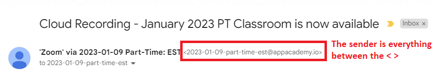

# What this project does

This Python project automatically grabs all the App Academy Lecture Zoom links and pairs them with the associated App Academy 
Open Topics for that day. The data is then conveniently stored into Google sheets so that students can access everything 
in one place when they need to review the class material.  

The Zoom links, passcodes, and dates are extracted from Gmail using the Gmail API and then stored in Google Sheets by
using a Google Sheets service account.  The Google Sheets API was not used. The App Academy Open topics are scraped 
using Selenium webdriver, using fairly complex logic to log in, click on specific elements, scrape neighbor elements, 
and finally store the topics into dictionaries. 

# Motivation and greatest challenges

I wanted to hone my Python skills with this project, and create something that would benefit me and my classmates! 
The hardest problems / bugs to solve were: 

1. Selenium webdriver loads App Academy Open on the Chrome browser in the default light theme. However, I was using the dark theme 
on App Academy Open, and unfortunately, some of the class names were different between the light and dark theme. This caused bugs when I tried to scrape specific elements. 
2. I was not properly using environment variables. I learned that the specific run configuration needs to have the path 
to that exact Python module, and that I need to run that run configuration and NOT the Python module itself.
3. The Gmail API quickstart guide and tutorials from Youtube and ChatGPT were missing a key component, which stopped me 
from getting my authentication tokens. The solution was adding my Gmail account under the "test users" field. 
4. There's a strange bug where if you are selecting a certain range of cells in the Google Sheets while the program
is adding data to it, Python will sometimes throw an error. It's pretty hard to replicate, and I'm not 100% sure the highlighted cell(s)
is causing the problem, but if you move where the current selected cell is and delete all the data before running the
Python program again, there's a good chance it will work! 

# Setup
Estimated setup time: 30 - 90 minutes

# Requirements: 
1. Python 3.11+
2. Gmail API 
3. Gsheets Service Account 
4. Email(s) from Gmail with the App Academy Zoom Lecture(s)
5. App Academy Open Account and Google Chrome browser (both optional -> if you don't need the topics from App Academy Open) 
6. Libraries for each Python module

# Gmail API setup - Obtaining your Client ID and Client Secret:

This guide does a good job, but it misses one step: https://ei.docs.wso2.com/en/latest/micro-integrator/references/connectors/gmail-connector/configuring-gmail-api/

Here are the steps to follow (as seen above, but step 8 is crucial)

1. Sign in with your Gmail account at this link: https://console.cloud.google.com/projectselector2/apis/credentials
2. Click on 'Select a Project' and click 'New Project' in the top right
3. Enter 'GmailConnector' or another name for your project and click 'Create'
4. Click 'Configure Consent Screen' near the top right or 'Oauth Consent Screen' from the left menu, click 'External' and click 'Create'
5. In the "App name" field, input your project name, either "GmailConnector" or whatever you named your project in step 3
6. Enter your Gmail account in the "User support email" field and in the "Developer contact information" at the bottom of the page
7. Click "Save and Continue"
8. *** Key step the guide misses - Within the "OAuth consent screen", click "Add Users" under the "Test users" field and input the same Gmail account you logged in with in step 1
9. Click "Credentials" from the left menu, and then click "Create Credentials" then select "OAuth client ID"
10. Select "Web application" from the drop-down menu
11. In the "Authorized redirect URIs" section, put https://developers.google.com/oauthplayground as the URI 
12. You now have your Client ID and Client Secret. Save them in a secure place, we will be using these later!
13. Click "Library" from the left side menu, and use the search bar and type in "Gmail API". Click on it and then click "Enable"

# Gmail API - Obtaining your Access and Refresh Tokens 

### Note: you will need to go through these same 6 steps to get a new Access and Refresh Token every 7 days

1. This same article does a good job of explaining the steps for getting your access and refresh tokens! https://ei.docs.wso2.com/en/latest/micro-integrator/references/connectors/gmail-connector/configuring-gmail-api/
2. Go to this link, then click the gear in the top right corner: https://developers.google.com/oauthplayground/
3. Check the box "Use your own Oauth Credentials" then enter your Client ID and Client Secret you received previously
4. On the left side, under step 1, scroll down and click on "Gmail API v1". Select everything except "https://www.googleapis.com/auth/gmail.metadata"
5. Click "Authorize APIs", leave all the boxes checked, and select your Gmail account
6. For step 2, click "Exchange authorization code for tokens", then save your access and refresh tokens securely
       
# Google Sheets setup - Creating your Google service account
    
ChatGPT output instructions after I helped it a bit, need to test this again myself because I forgot how I did it the first time

1. In the **Google Cloud console**, go to **Menu** > **IAM & Admin** > **Service Accounts**.
2. Click **Create service account**.
3. Fill in the service account details, then click **Create and continue**.
4. In the **Google Admin console**, go to **Menu** > **Security** > **Access and data control** > **API controls**.
5. Click **Manage Domain Wide Delegation**.
6. Click **Add new**.
7. In the **Client ID** field, paste the client ID you copied in step 5.
8. In the **OAuth Scopes** field, enter a comma-delimited list of OAuth scopes.
9. In the **Google Cloud console**, go to **Menu** > **APIs & Services** > **Library**.
10. Search for and click on the **Google Sheets API**.
11. Click **Enable**.
12. In the **Google Cloud console**, go to **Menu** > **IAM & Admin** > **Service Accounts**.
13. Click on the service account you created.
14. Click on the **Keys** tab.
15. Click **Add Key** > **Create new key**.
16. Select JSON as the key type and click Create.
17. A JSON key file will be downloaded to your computer. You should store this file securely and use it to authenticate your application with the service account.

# Setting up Environment variables for gmail API (optional)

If you are setting up a private repo or don't mind having your sensitive Client ID, Client Secret, and authorization tokens visible
within your code, you don't have to set up environment variables, but it is good practice because it protects your sensitive information.  

### Setup for Pycharm:

1. Click the menu icon in the top left, and then click "Run" then click "Edit Configurations"
2. Click the plus icon in the top left, then click "Python" in the drop-down menu
3. Under "Script Path", enter the path to the "NEW_gmail_zoom_links.py" file which would look something like this:
C:\Users\[YOUR USERNAME HERE]\[FOLDER OF PYTHON PROJECTS]\zoom-links-and-topic-app-academy\NEW_gmail_zoom_links.py
4. Under "Environment Variables", click the "Edit Environment Variables button" on the right, which looks like a rectangle with 3 lines on it
5. Click the + button in the top left, and input "CLIENT_ID" with your own value.  
6. Repeat step 5 with "CLIENT_SECRET", "REFRESH_TOKEN", and "ACCESS_TOKEN", then click "Apply" and "Ok"
7. If you choose not to create environment variables, you can simply find each of these values in the code, and replace everything
after the "=" with the value.

For example, at the bottom of the file "NEW_gmail_zoom_links.py", you would replace
 client_id = os.environ['CLIENT_ID']
 with 
 client_id = [PUT YOUR CLIENT ID HERE WITHOUT THE SQUARE BRACKETS]

# Setting up Environment variables for Google Sheets (optional)

1. Create another run configuration (steps 1-2) with the "Script Path" ending in "gsheets_conversion.py"
2. In addition to entering the "CLIENT_ID", "CLIENT_SECRET", "REFRESH_TOKEN", "ACCESS_TOKEN", also add a "SPREADSHEET_KEY" (follow the below steps)
3. Create a Google Sheet by going to www.drive.google.com, then click the "new" button in the top left and click on "Google Sheets"
4. In the url of the page, copy the url part after "/d/" and before "/edit".  For example, if you had an url of the following
 https://docs.google.com/spreadsheets/d/10n_41QH-U9_hktOJt_qBNw0s1WE0gaDcuD0jCosiUdQ/edit#gid=0
        Your "SPREADSHEET_KEY would be: 10n_41QH-U9_hktOJt_qBNw0s1WE0gaDcuD0jCosiUdQ
                                                                                                    
# Applying the proper "sender" filter to Gmail API to find only the App Academy Emails with the lecture links in them
                         
1. At the bottom of the "NEW_gmail_zoom_links.py", there's a variable called "sender", you'll want to replace that environment variable
with the name of the sender. For example, you'll want to create an environment variable with name of EMAIL_OF_SENDER and a value of the sender's email. 
2. To find the sender's Gmail, go into your Gmail where you receive the lecture links, and then near the top in 
really small font, you'll see the sender address.  See below image. 
  
